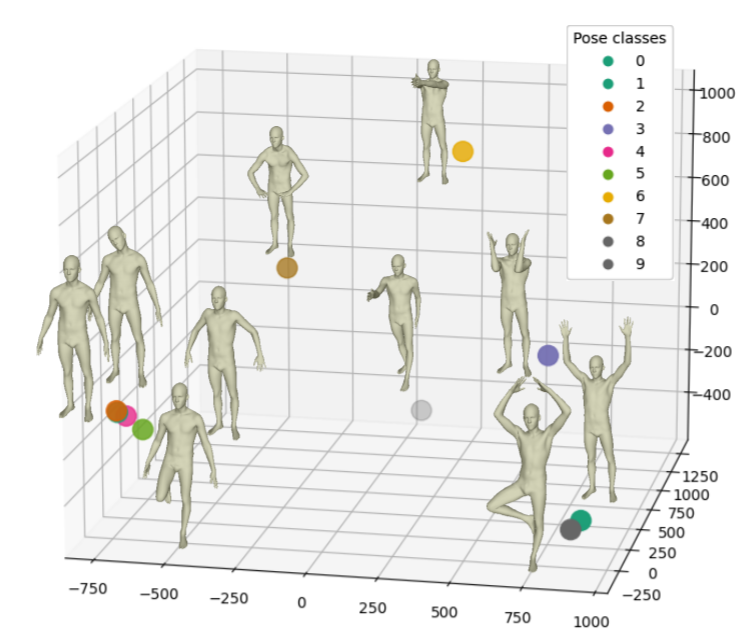

# Unsupervised_IEPGAN

This is the PyTorch implementation of our ICCV 2021 paper [Intrinsic-Extrinsic Preserved GANs for Unsupervised 3D Pose Transfer](https://arxiv.org/abs/2108.07520). <br>
[Haoyu Chen](https://scholar.google.com/citations?user=QgbraMIAAAAJ&hl=en), [Hao Tang](https://scholar.google.com/citations?user=9zJkeEMAAAAJ&hl=en), [Henglin Shi](https://scholar.google.com/citations?user=lIjqVQkAAAAJ&hl=en), [Wei Peng](https://scholar.google.com/citations?user=TDFM0QYAAAAJ&hl=en), [Nicu Sebe](https://scholar.google.com/citations?user=stFCYOAAAAAJ&hl=en), [Guoying Zhao](https://scholar.google.com/citations?user=hzywrFMAAAAJ&hl=en). <br>



#### Citation

If you use our code or paper, please consider citing:
```
@inproceedings{chen2021IEPGAN,
  title={Intrinsic-Extrinsic Preserved GANs for Unsupervised 3D Pose Transfer},
  author={Chen, Haoyu and Tang, Hao and Henglin, Shi and Peng, Wei and Sebe, Nicu and Zhao, Guoying},
  booktitle={Proceedings of the IEEE/CVF International Conference on Computer Vision},
  year={2021}
}
```

## Dependencies

Requirements:
- python3.6
- numpy
- pytorch==1.1.0 and above
- [trimesh](https://github.com/mikedh/trimesh)

## Dataset preparation
Please download FAUST data from [FAUST link](http://faust.is.tue.mpg.de/), and DFAUST dataset from [DFAUST link](https://dfaust.is.tue.mpg.de/) for training the model.

## Usage
The usage of our code is easy, just run the code below.
```
bash run.sh
```

Your can change the hyperparameters according to your GPU settings and needs in the run.sh file:
```
python  train.py --batch 4 ./dataset_3d/FAUST/  --edge_loss_setting 'rec_rec' --experi_path 'full_adap_GIH_Lap_rec' --server 'local' --rec_epoch 1200 --geo_epoch 1600 --iter 2000 --geoloss 0.005 --n_crop 1 --ref_crop 2 --sampling_number 120 --limb_n 4 --limb_sampling 600  --sampling_pattern 'adaptive'
```

## Acknowledgement
Part of our code is based on 

3D transfer: [NPT](https://github.com/jiashunwang/Neural-Pose-Transfer)，

GAN framework: [SWAP-Autoencoder (unofficial implementation)](https://github.com/rosinality/swapping-autoencoder-pytorch) and 

GIH implementation: [LIMP](https://github.com/lcosmo/LIMP). 
Many thanks!

## License
MIT-2.0 License
